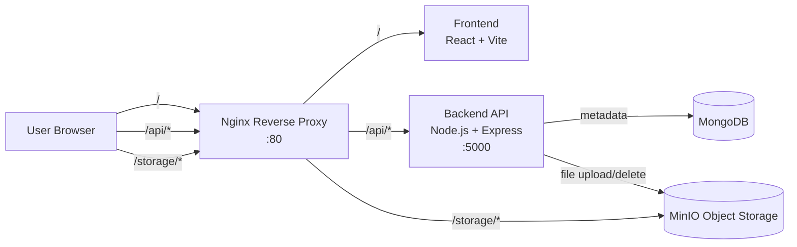

# Connect the Dots: Infrastructure Integration Challenge

## Project Overview
This project integrates independent services into a unified, production-style system using a reverse-proxy-first architecture.

It provides:
- Metadata storage and retrieval through a backend API and MongoDB
- File upload and access through MinIO object storage
- A minimal React UI for end-to-end interaction
- Centralized ingress routing via Nginx

## High-Level Architecture
All external traffic enters through Nginx on port 80.

- `/` routes to the frontend (Vite + React)
- `/api/*` routes to the backend (Express)
- `/storage/*` routes to MinIO object storage

Core services:
- `reverse-proxy` (Nginx)
- `frontend` (React + Vite)
- `backend` (Node.js + Express)
- `db` (MongoDB)
- `minio` (S3-compatible object storage)

## Architecture Diagram


## Repository Structure
- `docker-compose.yml`: Service orchestration and networking
- `proxy/nginx.conf`: Central routing configuration
- `backend/`: API, schema, integration tests, backend Dockerfile
- `frontend/`: UI, API client, frontend Dockerfile
- `ARCHITECTURE_JUSTIFICATION_REPORT.md`: Design decisions and trade-offs

## Setup From Clean Environment
### Prerequisites
- Docker Desktop with Docker Compose v2
- Git

### 1. Clone
```bash
git clone <your-public-repo-url>
cd iitpatnahack
```

### 2. Configure Environment
Create a root environment file for Docker Compose values:
```bash
cp .env.example .env
```

On Windows PowerShell:
```powershell
Copy-Item .env.example .env
```

Optional for running backend directly outside Docker:
```bash
cp backend/.env.example backend/.env
```

Note: values in `.env.example` are non-secret local development defaults for challenge reproducibility.

### 3. Start the Full Stack
```bash
docker compose up -d --build
```

### 4. Verify Running Services
```bash
docker compose ps
```

## Run and Test
### Open the App
- UI: `http://localhost`

### Run Backend Integration Tests
```bash
cd backend
npm test
```

### Optional API Smoke Checks
```bash
curl http://localhost/api/health
curl http://localhost/api/metadata
```

## Routes and Endpoints
### Proxy Routes (Nginx)
- `GET /` -> Frontend
- `ANY /api/*` -> Backend
- `ANY /storage/*` -> MinIO

### Backend Endpoints
- `GET /api/health` -> `{ status: "ok" }`
- `POST /api/metadata` -> save metadata `{ title, description, filePath }`
- `GET /api/metadata` -> list all metadata
- `DELETE /api/metadata/:id` -> delete metadata and associated object
- `POST /api/upload-file` -> upload file to MinIO, return `filePath`
- `GET /api/get-file?name=<filename>` -> stream object from storage bucket

## Networking and Service Exposure
- Only `reverse-proxy` is exposed to host (`80:80`)
- Internal services communicate over the private Compose network (`app-network`)
- Backend, DB, MinIO, and frontend are not directly host-exposed

## Assumptions
- This setup targets local development and challenge evaluation
- Root `.env.example` contains non-secret development defaults and must be replaced for production deployments
- Basic reliability is handled via service dependency wiring and stateless container restarts

## Stop and Cleanup
```bash
docker compose down
```

To remove containers, networks, and volumes:
```bash
docker compose down -v
```

## Submission Checklist
Use this section as a quick evaluator map for challenge requirements.

- Unified system integration: frontend, backend, MongoDB, MinIO, and Nginx are orchestrated in `docker-compose.yml`
- Central reverse proxy routing: defined in `proxy/nginx.conf` for `/`, `/api/*`, and `/storage/*`
- Minimal service-to-service communication: internal Compose network with only required service dependencies
- Metadata storage and retrieval: implemented via backend endpoints documented above
- File storage and access: upload to MinIO and access through proxy `/storage/*`
- End-to-end integration tests: backend test suite available via `cd backend && npm test`
- Containerization: backend, db, minio, proxy, and frontend are Dockerized
- Reproducibility: one-command startup using `docker compose up -d --build`
- Environment templates: `.env.example` and `backend/.env.example`
- Engineering justification report: `ARCHITECTURE_JUSTIFICATION_REPORT.md`

### Final Pre-Submission Validation
- `docker compose up -d --build` completes successfully
- `docker compose ps` shows all services running
- `http://localhost` loads the UI
- `GET http://localhost/api/health` returns status ok
- Upload, list, view, and delete flows work from UI
- `cd backend && npm test` passes
