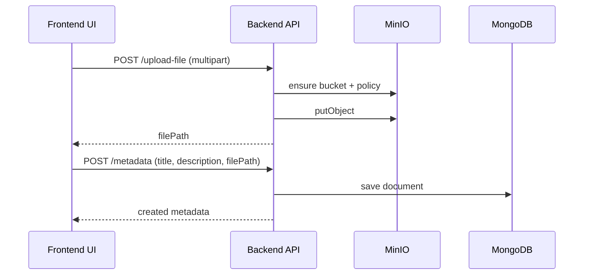

# Backend Service

Express API service for metadata management and file operations using MongoDB and MinIO.

## Service Flow Figure
```mermaid
flowchart LR
	C[Client via Nginx /api] --> A[Express Backend]
	A -->|metadata create/read/delete| M[(MongoDB)]
	A -->|upload/get/remove object| O[(MinIO uploads bucket)]
	O -->|served by proxy| S[/storage/uploads/...]
```

## Responsibilities
- Expose health and metadata endpoints
- Accept file uploads and store objects in MinIO
- Stream uploaded files back to clients
- Keep metadata records in MongoDB

## Tech Stack
- Node.js 18
- Express
- Mongoose
- Multer (memory storage)
- MinIO JavaScript SDK
- Jest + Supertest (integration tests)

## Environment Variables
Create a local env file from the template:

```bash
cp .env.example .env
```

Required variables:
- `MONGO_URL` (example: `mongodb://db:27017/your_database_name`)
- `PORT` (default: `5000`)
- `MINIO_ENDPOINT` (default: `minio`)
- `MINIO_PORT` (default: `9000`)
- `MINIO_ROOT_USER`
- `MINIO_ROOT_PASSWORD`

## Run Locally (without Docker)
Install dependencies and start the service:

```bash
npm install
node server.js
```

Server default URL:
- `http://localhost:5000`

## Run Tests
```bash
npm test
```

Note: integration tests expect MongoDB availability. In this project, the recommended path is to run via Docker Compose from the repo root.

## API Endpoints
- `GET /health` -> `{ "status": "ok" }`
- `POST /metadata` -> create metadata record
- `GET /metadata` -> list metadata records
- `DELETE /metadata/:id` -> delete metadata and linked object
- `POST /upload-file` -> multipart upload (`file` field), returns `filePath`
- `GET /get-file?name=<objectName>` -> stream object from `uploads` bucket

## Upload Sequence Figure


## File Storage Behavior
- Uploads are stored in MinIO bucket `uploads`
- Backend ensures the bucket exists before upload
- Backend sets public read policy (`ListBucket`, `GetObject`) so files are accessible through proxy route `/storage/uploads/...`

## Docker
This service is built by the backend Dockerfile and normally run through root Compose:

```bash
docker compose up -d --build
```
