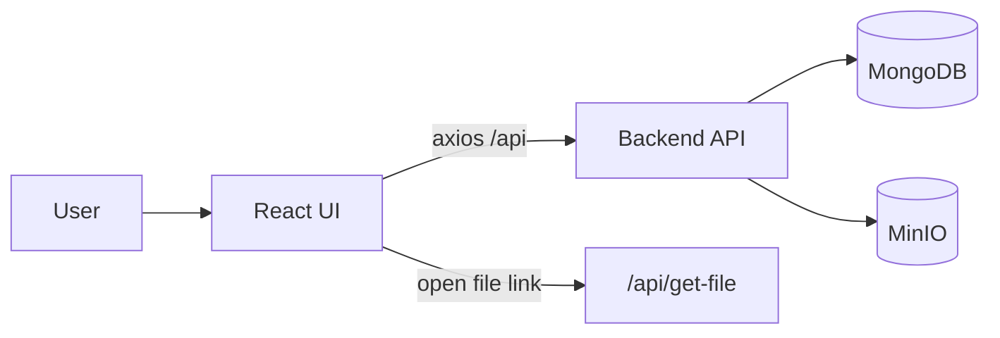
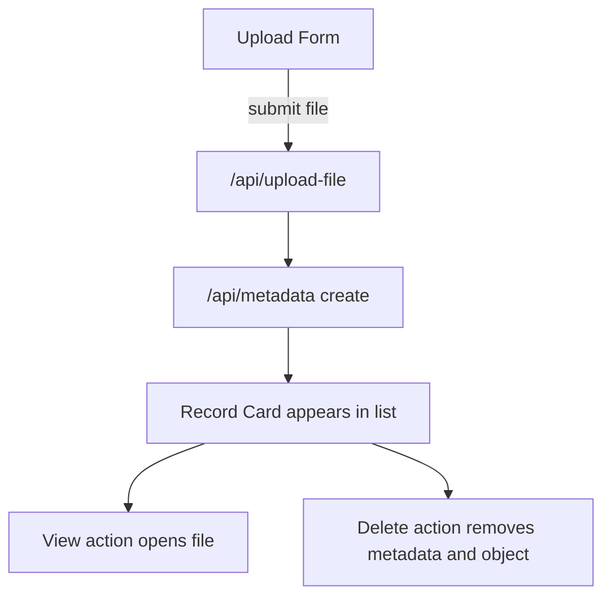

# Frontend Service

React + Vite client for the infrastructure challenge.

The UI allows users to:
- upload files
- save metadata records
- list all stored records
- open files in a new tab
- delete records and associated objects

## UI Architecture Figure


## Screens and Actions Figure


## Local Development
Install dependencies:

```bash
npm install
```

Run dev server:

```bash
npm run dev
```

Build production assets:

```bash
npm run build
```

Preview production build:

```bash
npm run preview
```

Lint:

```bash
npm run lint
```

## Runtime Notes
- API base URL is `/api` (proxy-routed by Nginx in Docker setup)
- File preview URLs are generated through backend endpoint `/api/get-file?name=<objectName>`

## Docker
In Compose mode, this service is built from the frontend Dockerfile and served by Vite preview on port 5173 internally.
